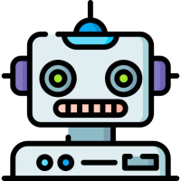

# Multi-Agents-Systems
Public deposit of the *CentraleSupélec* IA training.

This repository can be used to store sources and documentation about **Multi-Agents-Systems**. 

# Self-organization of robots in a hostile environment

## ***Summary***

The objective of this subject is to make your own **Agent Based Model (ABM)**. Sources are in python using Jupyter notebook and mesa framework.

A group of robots has to collect and sort radioactive waste in the most eastern area of a *2D* grid. Robots are divided in three colors, white, yellow and red.
The grid is also divided in three zones, $`z_1, z_2, z_3`$, respectively low radioactive area, medium and high.

White robots can only explore  $`z_1`$, yellow can explore $`z_1, z_2`$ and red can explore all the grid. Radioactivity is represented by radioactive waste. Those items can be found in three colors, white, yellow and red. 
White waste can only be picked up by white robots, yellow by yellow robots and red by red robots. If a robot manage to collect two wastes of his own color, he can merge them into one higher level waste. Red robots cannot merge wastes and robots can drop wastes.

Robots can move across the grid, but a robot cannot move on a cell already occupied by another robot. This rule is blur in the subject, meaning that a small set can move on the same cell, but try to avoid it.

Since white robots cannot move towards $`z_2, z_3`$ and yellow cannot move $`z_3`$ that means at the final goal is to accumulate red waste on the most eastern area. Because red robots cannot pickup white or yellow waste.

Use communication between robots and moving strategy to make the simulation ends faster !

Subject can be found in [robots mission directory](robots_mission/RobotsMission_subject.pdf).
